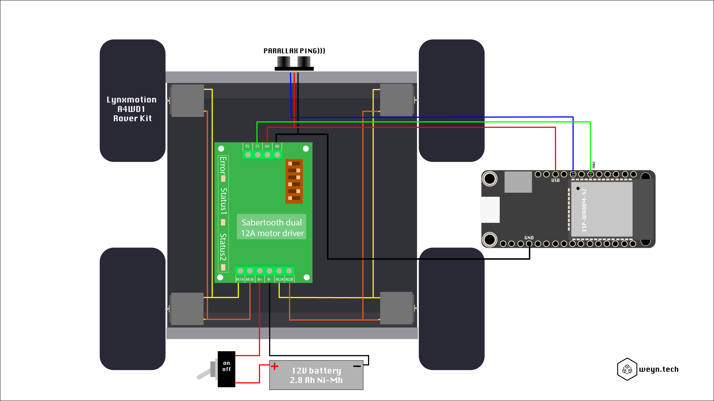
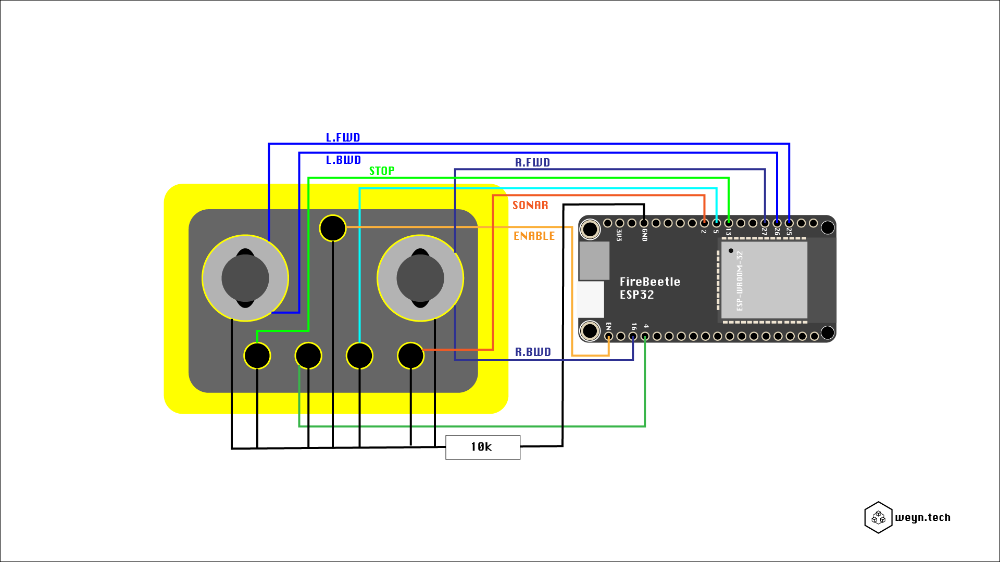

# WeynRover

## Hardware coponents

* Rover body: [Lynxmotion A4WD1](http://www.lynxmotion.com/p-603-aluminum-4wd1-rover-kit.aspx)
* Motor controller: [Sabertooth 2x12](https://www.dimensionengineering.com/products/sabertooth2x12)
* Sonar Sensor: [Parallax Ping)))](https://www.parallax.com/sites/default/files/downloads/28015-PING-Sensor-Product-Guide-v2.0.pdf)
* MCU: [Adafruit HUZZAH32 - ESP32 Feather](https://learn.adafruit.com/adafruit-huzzah32-esp32-feather/overview)

### Videos (dutch)

* [Basic Rover platform](https://www.youtube.com/watch?v=q37EDivFVcY)
* [Generic Rover controller](https://youtu.be/8a1gSWUQ1Mc)

## Schematics

### Rover

### Controller

